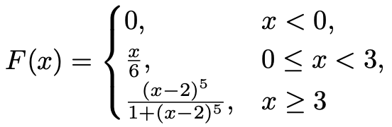

# Etteantud jaotusega pseudojuhuslike arvude genereerimine jaotusfunktsiooni pööramise meetodil

Tekita vaikeparameetritega runif generaatoriga seemnest 199 lähtuvalt 100000 pseudojuhuslikku arvu
ning kasuta neid selleks, et saada jaotusfunktsioonile

{width=300px}

vastavad pseudojuhuslikud arvud.

NB! Kindlasti veendu, et leitud pöördfunktsiooni korral kehtib võrdus F(F^−1^(u)) = u ∀u ∈ (0, 1) (seda võib teha graafiku joonistamise teel).

<br>

Tekitame pseudojuhuslikud arvud.

```{r}
n <- 100000
set.seed(199)
u <- runif(n)
```

<br>

Defineerime jaotusfunktsiooni ja selle pöördfunktsiooni.

Pöördfunktsiooni leidmiseks tuleb lahendada võrrand F(x) = u muutuja x suhtes.


```{r}
Fjaotus <- function(x){
  return(ifelse(x < 0, 0, ifelse(x < 3, x/6, (x-2)^5 / (1+(x-2)^5))))
}

Finv <- function(u){
  return(ifelse(u < 0, 0, ifelse(u < 1/2, 6*u, (u/(1-u))^(1/5) + 2)))
}

curve(Fjaotus(Finv(x)), 0.01, 0.99)
```

Graafikul näeme, et leitud pöördfunktsiooni korral kehtib võrdus F(F^−1^(u)) = u ∀u ∈ (0, 1)

```{r}
x = Finv(u)
```


# Testid

Kontrolli saadud arvude vastavust toodud jaotusfunktsioonile Cramer-von Mises testiga ning sõltumatust seeriate testiga (vaadeldes seeriaid pikkusega 1,2,3,4 ja neljast
suuremaid), defineerides kvantiilide abil 9 võrdse tõenäosusega sündmuse täissüsteemi.


## Cramer-von Mises

```{r}
#install.packages("goftest")
goftest::cvm.test(x, Fjaotus)
```

p-väärtus on väga suur (p-value = 0.9012 >> 0.1).

Jääme nullhüpoteesi juurde (arvud vastavad jaotusfunktsiooniga F juhuslikele suurustele)

<br>


## Seeriate test (sõltumatuse kontrollimiseks)

Leiame jaotuspunktideks kasutatavad reaalarvud jaotusfunktsiooni pöördfunktsiooni kasutades:

```{r}
cp <- c(-Inf, Finv((1:9)/10),Inf)
cp
```

<br>

Kasutame cut käsku, et teha kindlaks, mitmendasse kvantiilide poolt tekitatud osalõiku iga arv kuulub:

```{r}
sündmused <- as.numeric(cut(x, breaks=cp))
sündmused[1:10]
```

<br>

Uus seeria algab, kui vaadeldaval kohal olev sündmus erineb eelmisest ehk toimunud sündmuste numbrite vahe erineb nullist. Võime mõelda nii, et uus seeria algab ka esimesest vaatlusest, siis enne vahede leidmist kirjutame ette arvu, mis jadas ei saa esineda

```{r}
algused = which(diff(c(-1, sündmused)) != 0)
algused[1:10]
```

<br>

Seeriate pikkused on algusaegade vahed.

```{r}
seeriad = diff(c(algused))
seeriad[1:10]
```

<br>

Edasi käib kõik samamoodi nagu varem, ainult et sündmuse(uue seeria algamise) tõenäosus on 0.9 ja
kokku paneme kõik neljast pikemad seeriad.

Kuna neljast pikemate seeriate saamise tõenäosus on ainult 0.0001, siis peab Hii-ruut testi kasutamisel olema ettevaatlik. Statistiku väärtusele vastava p-väärtuse arvutamisel ei ole χ^2^ jaotuse kasutamine õigustatud, seega tuleks p väärtus leida simulatsioonide teel.

```{r}
ell = 5
seeriad[seeriad > ell] = ell
tabel = table(factor(seeriad, levels = 1:ell))
pA = 0.9
p <- c(pA * (1-pA)^(0:(ell-2)), (1-pA)^(ell-1))
chisq.test(tabel, p=p, simulate.p.value = TRUE)
```

p-väärtus >> 0.1, jääme nullhüpoteesi juurde (genereeritud pseudojuhuslikud arvud käituvad nagu sõltumatute katsete tulemused)
